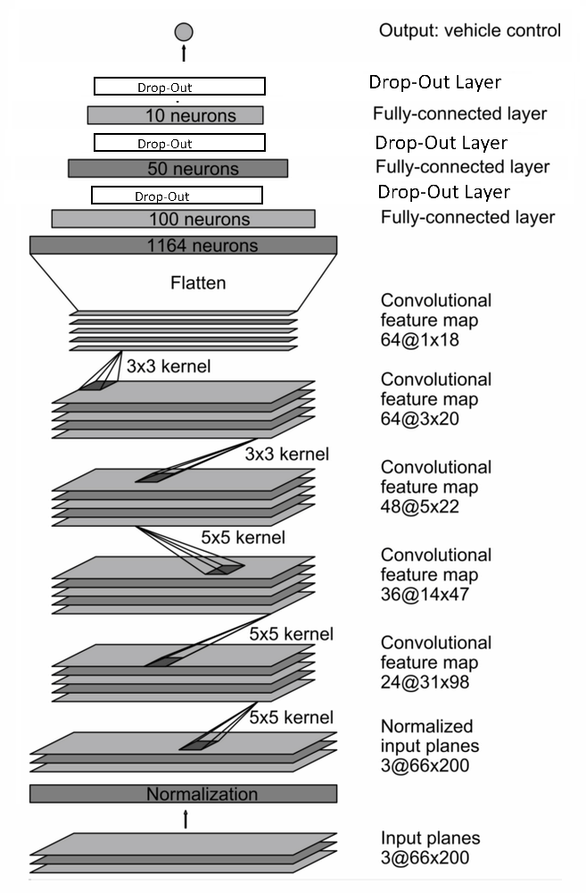

# **Behavioral Cloning Project** 

The goals / steps of this project are the following:
* Use the simulator to collect data of good driving behavior
* Build a convolution neural network in Keras that predicts steering angles from images
* Train and validate the model with a training and validation set
* Test that the model successfully drives around track one without leaving the road
* Summarize the results with a written report

## Final Result ##

[](videotrack1HD.mp4)

*[Click the image](videotrack1HD.mp4) to play the video in HD or [click here](videotrack1.mp4) for low resolution.*


### Model Architecture and Training Strategy

#### 1. An appropriate model architecture has been employed

My model is a modified version of the NVIDIA CNN model. It consists of a convolution neural network with 3x3 and 5x5 filter sizes and depths between 3 and 64 enhanced with 3 dropout layers.

The model includes RELU layers to introduce nonlinearity, and the data is normalized in the model using a Keras lambda layer.

#### 2. Attempts to reduce overfitting in the model

The model contains dropout layers in order to reduce overfitting. Image augmentation in form of flipping and adjusting brightness has been performed.

The model was trained and validated on different data sets to ensure that the model was not overfitting. The model was tested by running it through the simulator and ensuring that the vehicle could stay on the track.

#### 3. Model parameter tuning

The model used an adam optimizer, so the learning rate was not tuned manually.

#### 4. Appropriate training data

Own recorded training data and Udacity's training data was chosen to keep the vehicle driving on the road. I used a combination of driving against clockwise, center lane driving and recovering from sides of the road back to the center.

For details about how I created the training data, see the next section. 


### Architecture and Training Documentation

#### 1. Solution Design Approach

The overall strategy for deriving a model architecture was to develop a simple model step by step.
First I started with the simplest model possible: only one input and one output layer, to get the fundamentals working. 
I tested the correct loading of the data from the driving log, visualized the images and tested the batch processing.
Keras has chosen automatically a batch size of 32 but I changed it to 128 because it's faster. 256 lead to a kernel error. After getting the batch processing working I tried with the LeNet5 model and trained it with the available data set from Udacity. The car drove offside the road. For debugging purpose I wrote a small tool to predict an steering angle with an image as input. The predictions were mostly wrong, so it was obvious why the simulator couldn't drive the road. I started over with the Nvidia model because it was recommended in the project description. I trained it with the available dataset and added flipped images.

Because most of the steering angles are 0, I added a filter for steering angles <> 0 to prevent a bias for driving straight. Now I got problems on straight roads and I changed to filter only 50% out of all images with a steering angle = 0. Additionally, I filtered all extrem angles < or > 30 degrees.

In order to gauge how well the model was working, I split my images and steering angle data into a training and validation set with 80 / 20 %. 

The final architecture looks like this:


```
Layer (type)                 Output Shape              Param #   
_________________________________________________________________
lambda_1 (Lambda)            (None, 80, 160, 3)        0         
_________________________________________________________________
conv2d_1 (Conv2D)            (None, 38, 78, 24)        1824      
_________________________________________________________________
conv2d_2 (Conv2D)            (None, 17, 37, 36)        21636     
_________________________________________________________________
conv2d_3 (Conv2D)            (None, 7, 17, 48)         43248     
_________________________________________________________________
conv2d_4 (Conv2D)            (None, 5, 15, 64)         27712     
_________________________________________________________________
conv2d_5 (Conv2D)            (None, 3, 13, 64)         36928     
_________________________________________________________________
flatten_1 (Flatten)          (None, 2496)              0         
_________________________________________________________________
dense_1 (Dense)              (None, 100)               249700    
_________________________________________________________________
dropout_1 (Dropout)          (None, 100)               0         
_________________________________________________________________
dense_2 (Dense)              (None, 50)                5050      
_________________________________________________________________
dropout_2 (Dropout)          (None, 50)                0         
_________________________________________________________________
dense_3 (Dense)              (None, 10)                510       
_________________________________________________________________
dropout_3 (Dropout)          (None, 10)                0         
_________________________________________________________________
dense_4 (Dense)              (None, 1)                 11        
_________________________________________________________________
```

I found that the unmodified Nvidea-model had a low mean squared error on the training set but a high mean squared error on the validation set. This implied that the model was overfitting and I added 3 dropout layers in the 3 output layers.  One reason might be that the model deals with high definition images and not with low-resolution gamegraphics from a simulator. Another reason could be the lack of training data. 

I re-read the the theory to doublecheck my implementation of the model. [https://devblogs.nvidia.com/parallelforall/deep-learning-self-driving-cars/]. The implementation was correct, so I generated more data by adding the left and right camera images and introduced a correction for the steering angle. Because the images from the left and right camera are "off the center" from the left/right perspective, the steering angles has to be adjusted. 
The car should correct it's driving back to the center when it sees an image off the centre. Therefore a correction factor for the steering angle was added.  After trying different factors between 5 and 30 degrees I ended up with 28% correction factor.
Using 3 cameras generates 3x as much training data, with additonally flipping images for curves even more. This should b e enough to train the model. The processing time now increased a lot and I decided to crop and resize the image to half the size of x andy, reducting the toal size by 4. This speeded up the calcuation significantly. Even if the original Nvidia model was built for 66x200 pixels, it had no problems to process my reduced image sizes of 80x160 pixels. But the model did still not work. 

I added the cropping and resizing also in the drive.py and it showed much better results ncw. 
Even 30 epochs didn't bring up a perfect round and so I added more augmented images with random brightness. **With this modification the car was able to complete the first track**. Next I reduced the number of epochs in respect to the learning curves and found out that just 3 epochs are enough. I tried with the smaller dataset from Udacity to further optimize the calculation time. At the end of the process, the vehicle is able to drive autonomously around the track without leaving the road.


#### 2. Final Model Architecture

The final model architecture  consisted of a convolution neural network with the following layers and layer sizes:
- 1 Lambda  normalization Layer
- 5 Convolutional Layers
- 3 Fully Connected Layers


Here is a visualization of the architecture:


#### 3. Creation of the Training Set & Training Process

To capture good driving behavior, I first recorded two laps on track 1 using center lane driving. 
I used keyboard control but it resulted in bad results because even in curves the arrow keys were pressed for a very short time, released and pressed again. So steering angles with 0 are recorded even in sharp curves.  Next try was with mouse control and the result was better. 
The best results I got when I connected my PS3 Gamecontroller via USB.

First I drove 2 rounds forward and tested the model. 


Because it didn't work, I collected more data with driving the same track in the other direction. More finetuning was needed and I recorded some sharp curves and finding back to the center of the lane


To augment the data sat, I also flipped images and steering angles thinking that this would help generalizing the model as it has mostly only left curves and will learn to drive right curves as well.


The model was doing well but it was not able to complete the round. 
I tried ELU instead of **RELU** activation, but the result got worse.
For tuning purposes I tried also **different color schemas**, e.g. YUV instead of RGB. I also added more augmentation in form of **random brightness** to new random images. This was the final breakthrough and the car finished the track. I could even reduce the number of epochs to 3 and reduced training data from ~ 25,000 samples to 5148 to optimize the speed of calculation.

Statistics of the final run with 3 epochs, batchsize=128 on my laptop:

 


#### Preprocessing
The following steps were taken for preprocessing the images:

**Filtering of steering angles by dropping images with **
- 0 degree ( dropping 50% ) 
- degress < or > 30 

**Cropping images 160x320 -> 80 x 320 **  


**Resizing images to 80x160**  


**Adding images with random brightness**  
 &nbsp; 

**Adding 50% of flipped images with steering angle <>0**  
  &nbsp; 

I finally randomly shuffled the data set and put 20% of the data into a validation set. 

I used this training data for training the model. The validation set helped determine if the model was over or under fitting. The ideal number of epochs was 3 as evidenced by trail and error. I used an adam optimizer so that manually training the learning rate wasn't necessary.

#### Lessons learned:
- Preprocessing is as important as the model architecture itself
- Models calculated on AWS Clound doesn't run on local machine because fo different Tensorflow Versions. It was difficult to Upgrade the Tensorflow GPU library or downgrade my Windows Anaconda installation
- If you crop input into the model, the output of the simulator processed by drive.py also has to be cropped
- randon rightness augmentation was very helpful


